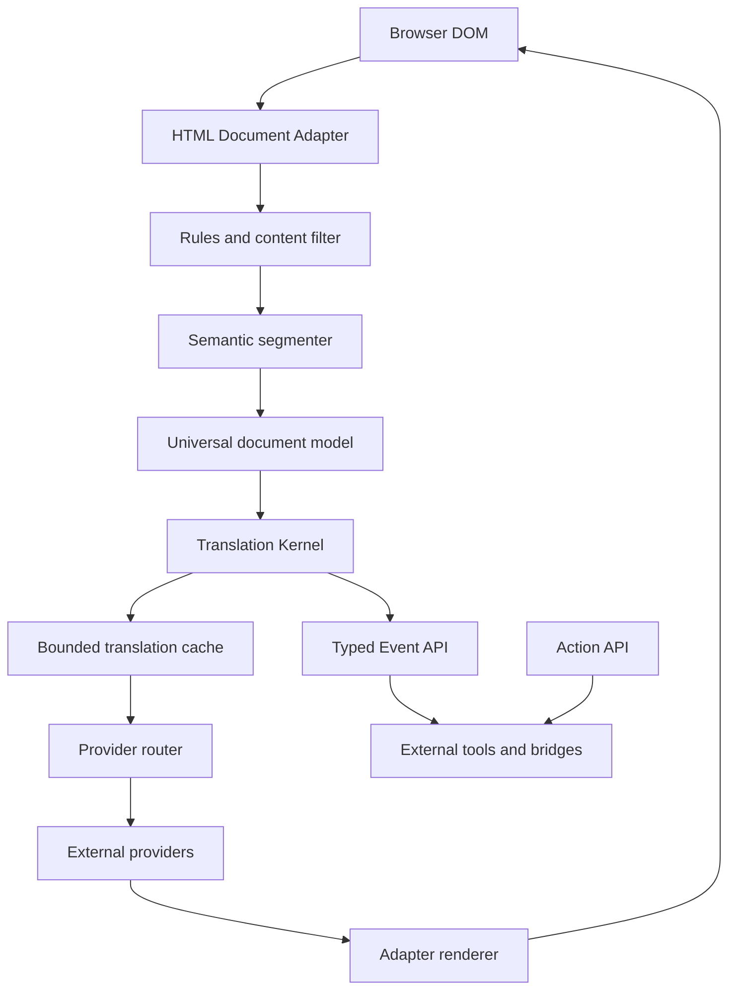

# Architecture

The microkernel only handles translation primitives. The event-driven boundary lets extensions observe outcomes without accessing internal maps or DOM anchors. API contracts are version 1 (`API_VERSION`); configuration has its own `schemaVersion: 1`.

## Universal document model and Adapter API

The kernel depends on `DocumentAdapter`, never on `HTMLElement`. Documents contain blocks and segments, with optional opaque metadata. The HTML adapter keeps DOM references outside the model. A memory adapter demonstrates the same kernel without HTML. External PDF/EPUB/OCR/subtitle adapters can implement the protocol; none of those readers are included.

## Provider API and scheduling

Providers receive ID-bearing segments and a bounded context. Results must form a complete, unique ID set with nonempty text. Router batches have a maximum of 64; kernel/browser batches use 16. Timeout races also cover providers that ignore AbortSignal. Parent cancellation prevents retries and fallback. Retry count is capped at three; application policy is one retry. Health stores failure counts and last-success timestamps, without circuits or a gateway.

The kernel uses an LRU cache capped at 1,000 entries with one-hour expiry. Keys include source/target and context, so page-context-dependent output is not reused across unrelated pages. Cached translations get current segment IDs. Cache and export data are ephemeral; no page history database.

## DOM mapping and rendering

The scanner walks text nodes and groups them at their nearest semantic block. Nested spans, links and inline elements stay within a segment. Long blocks use sentence boundaries with Unicode-safe hard limits. Anchors hold original text nodes, their block and segment IDs. A changed block receives a new generation ID; unchanged blocks retain theirs during mutation processing. IDs are stable within one adapter session, not across reloads.

Translation spans use `data-tk-translation` and `data-tk-segment-id`. Bilingual rendering appends plain text without replacing original elements. Translation-only mode blanks mapped Text nodes while retaining their node identity and original data; restore writes only to nodes still blank, preserving application changes. Inline elements and event handlers remain attached. Arbitrary framework reconciliation can remove generated nodes; the next mutation reconciles surviving anchors. Content inside code/math/form/navigation/hidden/editable regions is excluded. Shadow roots and iframes are outside v0.1 support.

## Mutation handling

Observation starts when translation is activated, is debounced by 80 ms and scans deduplicated dirty block subtrees. Own writes temporarily disconnect observation; pending application records are drained before writes so they remain scheduled. Removed anchors and translation values are pruned. Stop/Restore/Dispose disconnect, clear timers and cancel requests. Idle unactivated pages have no injected script, observer or scan. A broad application replacement may legitimately require a broad subtree scan.

## Action API and Event API

ActionRegistry accepts `{id,title,run}` and bounded selection context. The browser composes URL actions from portable settings, encoding selected text and rejecting non-HTTP(S) protocols. External destinations own the subsequent workflow. EventBus snapshots payloads for each handler, isolates listener exceptions and returns unsubscribe functions. Kernel state is exposed through snapshots (`getSegments`, `exportDocument`), never mutable internal references.

## Security boundaries

The service worker owns provider config and network calls. Storage access is restricted to trusted extension contexts before reading/writing secrets. Only exact internal popup/options URLs may read full config or run actions; only HTTP(S) top-frame content senders may request bounded translation batches. There is no externally-connectable message listener or page-global SDK injection. Content scripts get config with no providers or keys. Concurrency is bounded globally and per tab. Credentials are omitted and HTTP redirects rejected. The application requests activeTab, scripting, storage and optional provider origins; it does not request all-page persistent access.

CSP allows local scripts only. No eval, dynamic functions, remote JavaScript, innerHTML translation injection or executable model output. Imports validate known schema fields and reject invalid protocols, languages, duplicate IDs and unsafe headers. API keys are unencrypted local data, not a vault. Explicit action URLs may use arbitrary HTTP destinations because users configure them; provider HTTP endpoints are limited to loopback.
